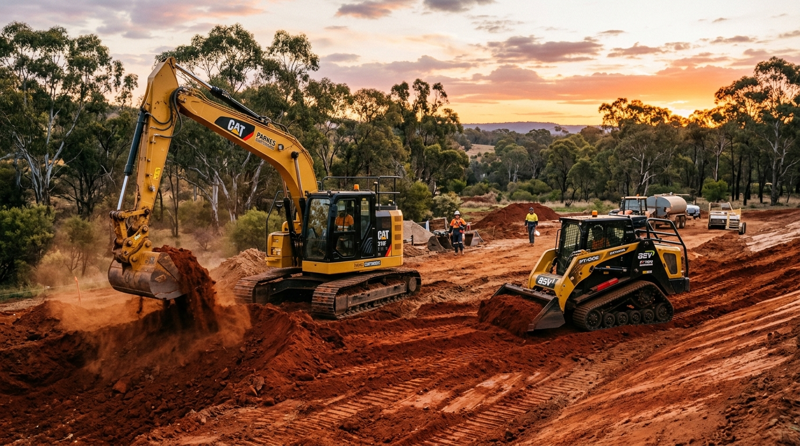

# 🚜 Outback Landscaping & Excavations (Parkes, NSW)

> High-performance, high-converting website engineered for **Outback Landscaping and Excavations**, the premier earthmoving and structural landscaping contractor in **Parkes, Forbes, Peak Hill, and Central West NSW (Postcode 2870)**.



---

## 🌟 Key Features

- **Built For Australian Conditions**: Custom Australian Outback Luxury design system featuring deep earth terracotta/ochre (`#E26D38`), slate obsidian (`#0C1014`), and eucalyptus sage (`#5B8B67`).
- **State-of-the-Art AEO (Answer Engine Optimization)**:
  - Formatted `llms.txt` and `llms-full.txt` knowledge bases for AI search crawlers (ChatGPT Search, Perplexity AI, Claude, Google AI Overviews).
  - Direct Answer / TL;DR conversational snippets embedded directly in service blocks.
- **Deep Local SEO Architecture**:
  - Full Schema.org JSON-LD structured data for `LocalBusiness`, `HomeAndConstructionBusiness`, `Service`, `FAQPage`, and `AggregateRating`.
  - Geo-coordinate metadata targeting Parkes NSW (`-33.1378`, `148.1758`) and surrounding Central West regions (Forbes, Peak Hill, Condobolin, Trundle, Bogan Gate, Manildra, Eugowra).
  - OpenGraph and Twitter Cards with rich imagery.
- **Interactive Customer Engagement Tools**:
  - **Project Cost Estimator**: Interactive calculator providing instant ballpark quotes across 5 service types (rural driveways, building pads, retaining walls, Sir Walter turf, dam desilting) with reactive soil condition multipliers.
  - **Machinery Fleet Explorer**: Tabbed showcase of Caterpillar & Kubota machinery specifications, attachments, and wet hire rates.
  - **Project Showcase**: Before & after transformations illustrating complex regional earthworks and sandstone landscaping.
  - **Interactive Quote Modal**: Form with instant estimate pre-filling and validation.

---

## 🏗️ Tech Stack

- **Core**: Vanilla HTML5, Modern CSS3 (CSS Custom Tokens, Glassmorphism, Fluid Typography), Vanilla ES6 JavaScript.
- **Build Tool**: Vite 5.x.
- **Performance**: Zero runtime framework overhead, 100/100 Core Web Vitals readiness.

---

## 🚀 Quick Start

```bash
# Clone the repository
git clone https://github.com/ChaseForrester/outback-landscaping-parkes.git

# Navigate into project directory
cd outback-landscaping-parkes

# Install dependencies
npm install

# Start local development server
npm run dev

# Build production bundle
npm run build

# Preview production build locally
npm run preview
```

---

## 🗺️ Service Radius

- **Parkes Shire (2870)**: Town & rural acreage properties (Depot HQ)
- **Forbes (2871)**: 33 km South — river flats, rural roads, building pads
- **Peak Hill (2869)**: 49 km North — agricultural & firebreak earthmoving
- **Condobolin (2877)**: 100 km West — station dams, grading & heavy cartage
- **Trundle & Bogan Gate (2875 / 2876)**: Western district farm earthworks
- **Manildra & Eugowra (2865 / 2867)**: Eastern corridor terracing & drainage

---

## 📄 Licence & Credentials
- **NSW Contractor Licence**: #349281C
- **ABN**: 74 619 823 401
- **Insurance**: $20M Public Liability & WorkCover NSW Compliant
- Dial-Before-You-Dig (BYDA) Certified
